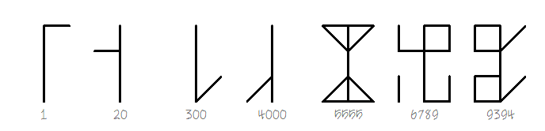

# Cistercian numerals

## Site

- [site](https://alex-hedley.github.io/cistercian-numerals/)

## Links

- https://en.wikipedia.org/wiki/Cistercian_numerals
  - https://www.unicode.org/L2/L2020/20290-cistercian-digits.pdf
- https://adrianroselli.com/2021/02/cistercian-svg.html
- https://codepo8.github.io/cistercian/
- https://bobbiec.github.io/cistercian-font.html
- https://digitalseams.com/blog/making-a-font-with-9999-ligatures-to-display-thirteenth-century-monk-numerals

### Fonts

- [fonts](fonts/README.md)
  - https://github.com/ctrlcctrlv/FRBCistercian

---

- [docs](docs/README.md)
<!-- - [images](images/README.md) -->
- [src](src/)

<!-- ## Run

`cd src`

- `py -m http.server`
- `python -m http.server`
- `python3 -m http.server` -->
